# Readability.Lib

**Next-Generation Accessible Library & Interactive Storytelling Platform**

Readability.Lib is designed to bridge the gap between the new generation's fast-consumption habits and the timeless joy of reading. By leveraging advanced AI and accessibility tools, we transform stories into bite-sized, 1-2 minute experiences accompanied by generative imagery and interactive elements.

---

## 🚀 Key Features

* **⚡ Micro-Reading Experience:** Stories are curated to be consumed in just 1-2 minutes.
* **🎨 AI-Generated Imagery:** Every story is visually brought to life using Hugging Face's text-to-image models.
* **🤖 Advanced AI Integration:** Powered by **Gemini 1.5 Pro**, OpenAI, and our fine-tuned model, **Ozi**.
* **♿ Accessibility First:** Integrated Google Cloud Text-to-Speech (TTS) and Speech-to-Text (STT) APIs ensure everyone can enjoy the content.
* **🎮 Interactive Storytelling:** Users become the protagonist in RPG-style stories managed by AI.
* **🔒 Secure & Private:** Fernet-encrypted real-time messaging and robust OTP-based authentication.
* **📄 PDF Transformation:** Extract and "gamify" boring PDF content into enjoyable formats.

## 🛠️ Tech Stack

| Component | Technology |
| :--- | :--- |
| **AI Core** | Gemini 1.5 Pro, OpenAI, Custom "Ozi" Model |
| **Image Gen** | Hugging Face (Text-to-Image) |
| **Accessibility** | Google Cloud TTS & STT |
| **Database** | SQLite3 (History & Data Management) |
| **Security** | Fernet Encryption, OTP Email Verification |

---

## 📸 Application Showcase

### 1. User Interface & Onboarding
A clean, modern interface ensuring a smooth user journey from landing to login.

| Landing Page | Login | Register |
| :---: | :---: | :---: |
| 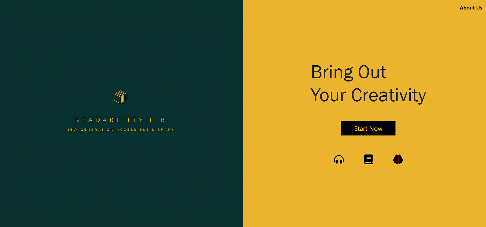 | 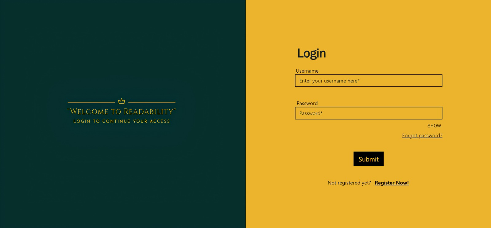 | 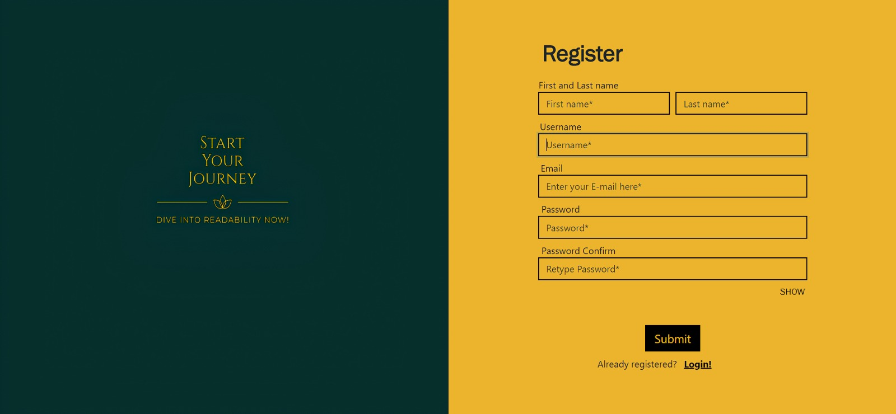 |

### 2. Core Experience
Browse the main library and dive into stories with instant visual feedback.

| Main Library | Story View & Interaction |
| :---: | :---: |
| 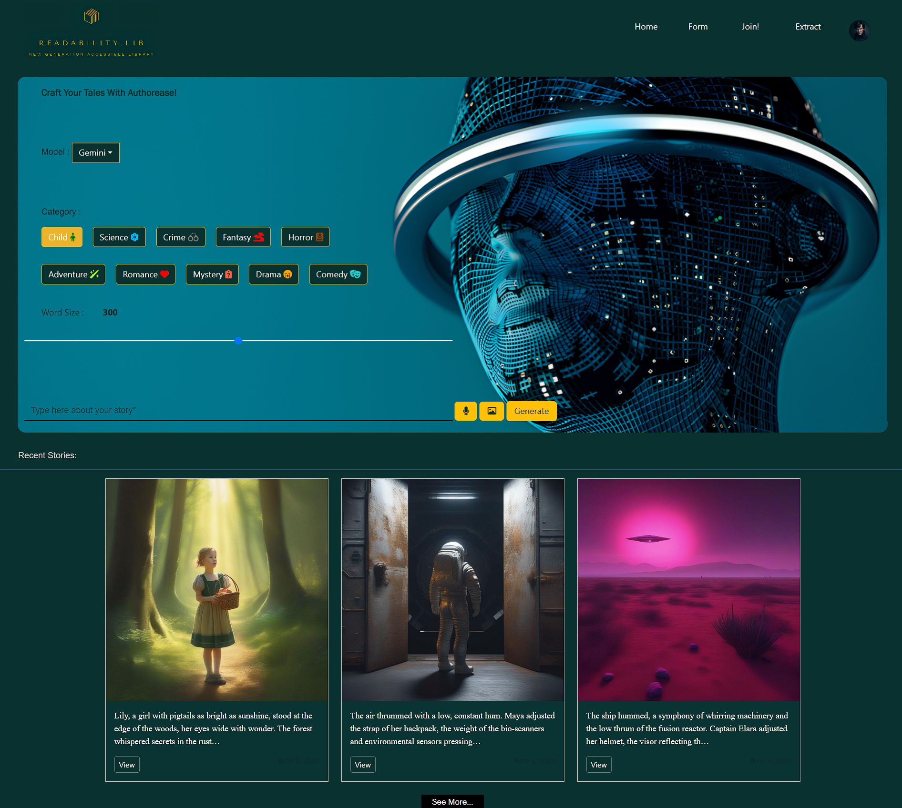 | 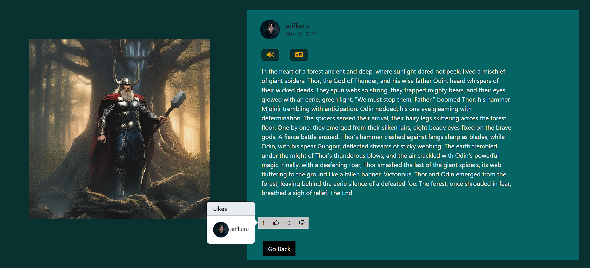 |

### 3. Community & Social Features
Users can comment, share posts, and interact with the community.

| Commenting | Social Sharing |
| :---: | :---: |
| 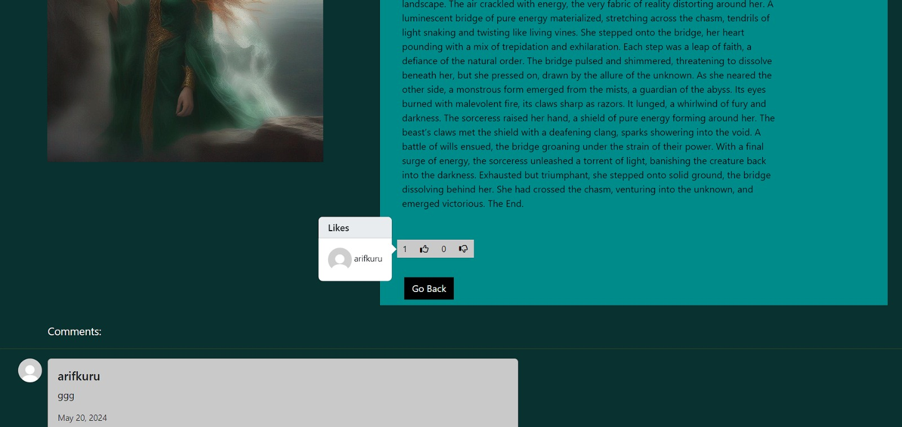 |  |

---

## 🔐 Encrypted Messaging
Real-time messaging with **Fernet Encryption** (up to a second latency) ensuring private conversations.

| Chat Interface | User Profile |
| :---: | :---: |
| 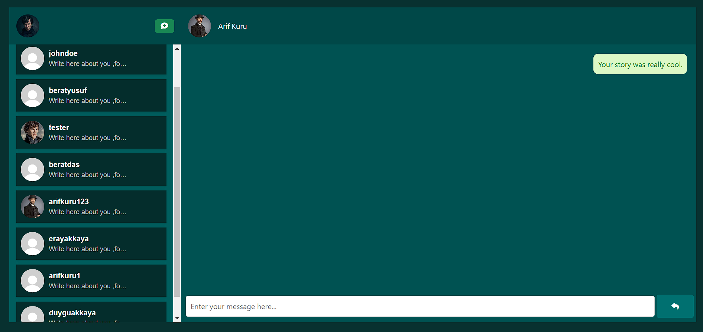 | 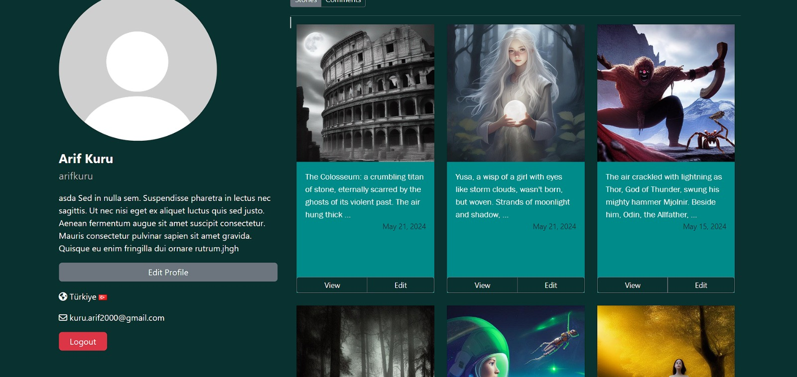 |

---

## 🎮 Interactive & Gamified Stories
Using Gemini 1.5 Pro, we turn reading into a game. Below is an example of a **Harry Potter** themed interactive session where the user makes choices that affect the narrative.

| Intro | Choice A | Choice B | Outcome |
| :---: | :---: | :---: | :---: |
| 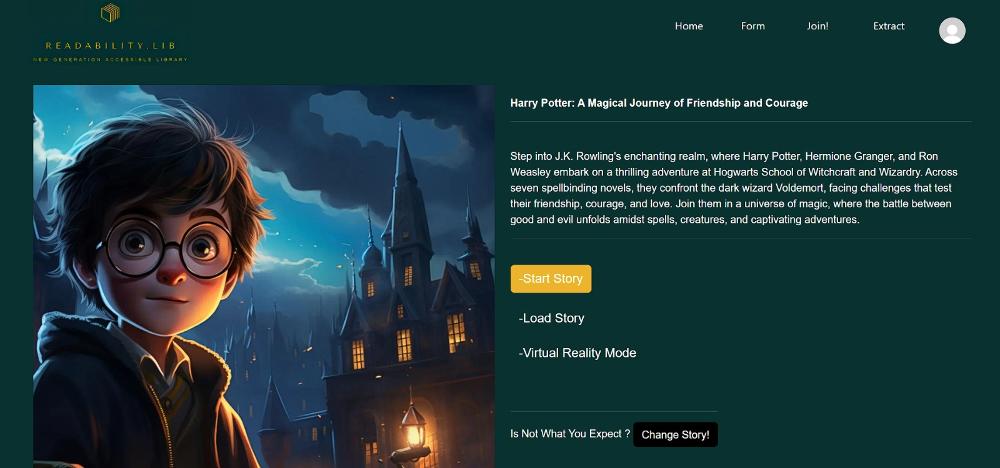 | 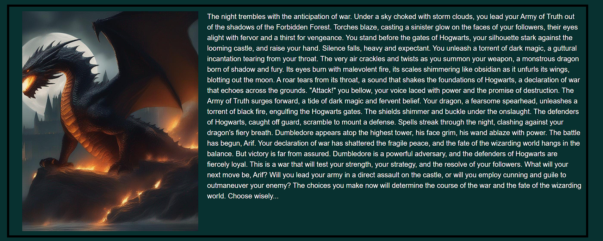 | 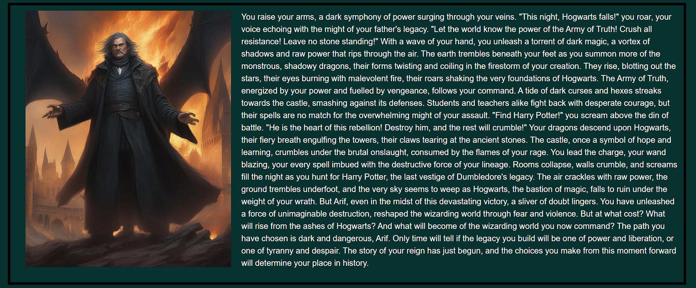 | 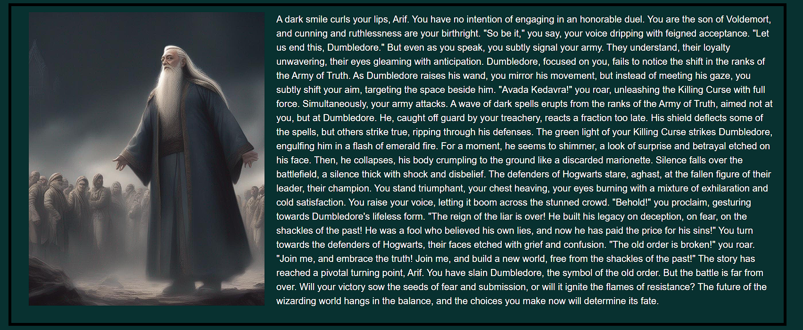 |

**Online Interactive Mode:**

---

## 📄 PDF Extraction Tool
Transform standard PDFs into more enjoyable, readable formats automatically.

| Original Extraction | Enhanced View |
| :---: | :---: |
| 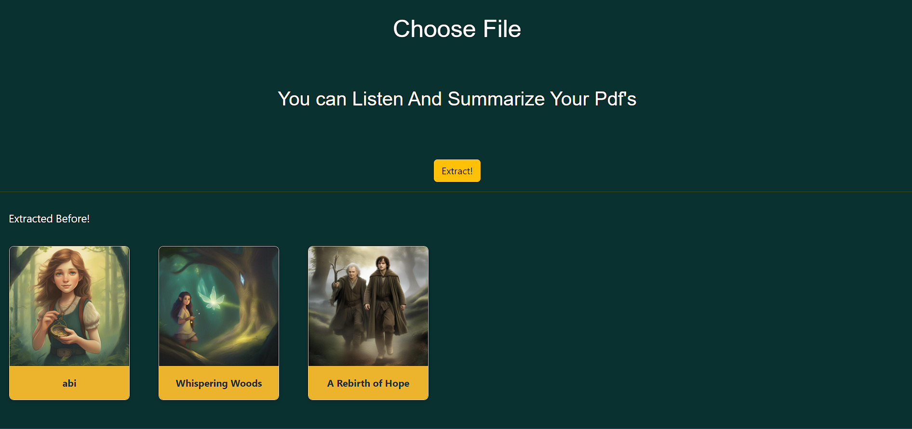 | 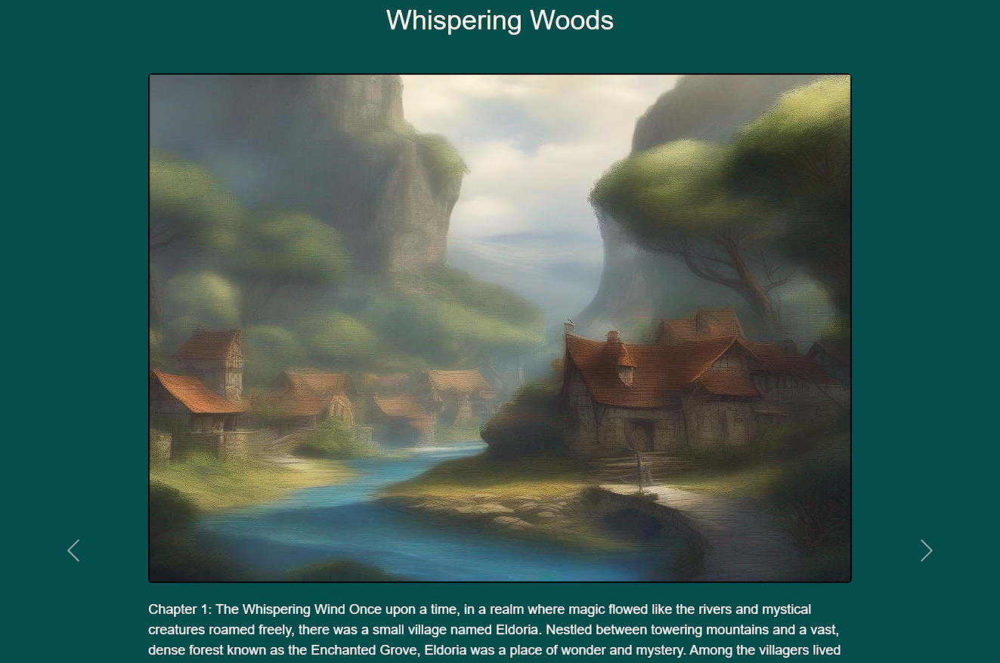 |

---

## ✅ TODOs & Roadmap

- [ ] Refactor OTP Code (Remove global variable definition).
- [ ] Optimize history management queries.

---

 

  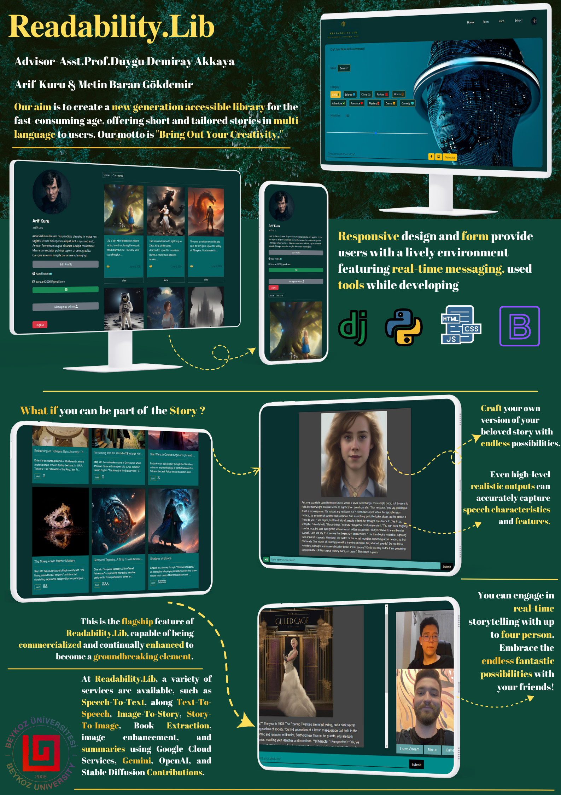

